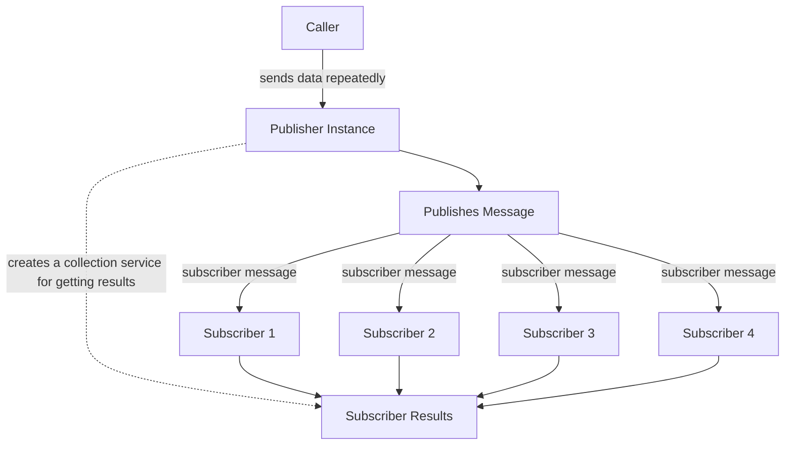

# Messaging

This part of the codebase is for internal communication WITHIN the server - not for any car-server communication. We use this style of communication for tasks where multiple calculations need to be ran on the same piece of data. 

For example, when we are parsing MCAP files and performing calculations on it, it doesn't make sense to re-read the file for every task we want to perform (like converting it to a MATLAB file and plotting Latitude/Longitude data). To remedy this, we use a publisher/subscriber messaging model* where for every MCAP message we read, we can send messages to specific subscribers depending on MCAP topic.

*It's different from normal pub/sub models because usually the publisher doesn't handle the collection of results. However, for our case the implementation is much cleaner when we have the publisher just create a new goroutine to handle subscriber result collection

The list of subscribers is dynamic as multiple parts of the codebase could create different publishers connected to different subscribers.

The subscribers are (for now) listed in `subscribers.go`. And theh bulk of the logic for each subscriber lives in `messaging/subscribers`

This is the layout of how the messaging system works.

